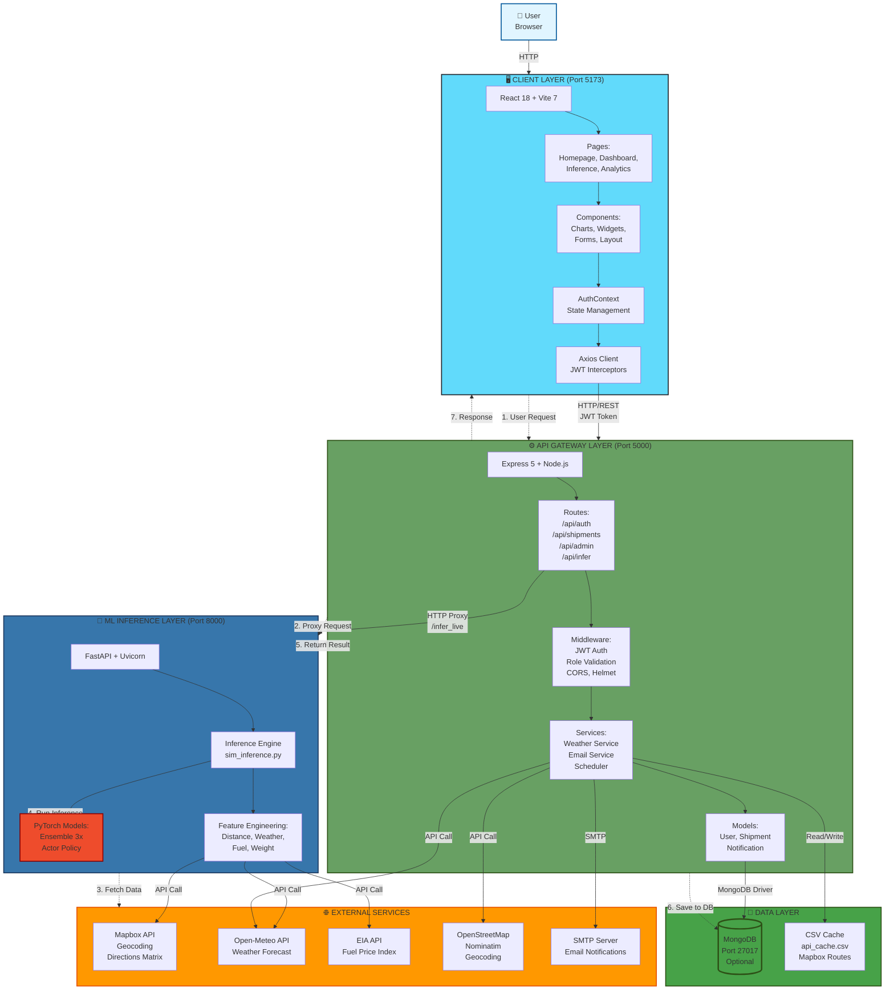

# Sim-to-Dec Logistics Intelligence Platform - Complete Architecture Diagram

This document contains a single comprehensive architecture diagram showing all components, services, data flows, and integrations of the Sim-to-Dec platform.

---

## Complete System Architecture

---

## Architecture Components Breakdown

### 🖥️ Client Layer (Port 5173)
- **Technology**: React 18, Vite 7, Tailwind CSS
- **Components**: Pages, Charts, Widgets, Forms
- **State Management**: React Context API, localStorage
- **Communication**: Axios with JWT interceptors

### ⚙️ API Gateway Layer (Port 5000)
- **Technology**: Node.js, Express 5
- **Security**: JWT authentication, Role-based access control
- **Features**: Rate limiting, CORS, Helmet security headers
- **Services**: Weather integration, Email notifications, Background jobs

### 🤖 ML Inference Layer (Port 8000)
- **Technology**: Python 3.10+, FastAPI, PyTorch 2.5.0
- **Models**: Ensemble of 3 simulators + Actor policy network
- **Process**: Feature engineering → Normalization → Monte Carlo simulation → Recommendation

### 💾 Data Layer
- **MongoDB**: User data, shipments, notifications, history (optional)
- **CSV Cache**: Mapbox API responses for route caching

### 🌐 External Services
- **Mapbox**: Geocoding and route distance calculations
- **Open-Meteo**: Weather data and forecasts
- **EIA**: Fuel price indices
- **OpenStreetMap**: Geocoding fallback
- **SMTP**: Email delivery

---

## Data Flow Sequence

1. **User Request**: User submits shipment request via React client
2. **Authentication**: Client sends JWT token with API request
3. **Server Processing**: Express validates token and processes request
4. **ML Proxy**: Server forwards inference request to FastAPI service
5. **External Data Fetch**: ML service fetches route, weather, and fuel data
6. **Model Inference**: PyTorch models process features and generate recommendations
7. **Data Persistence**: Server saves shipment with AI recommendation to MongoDB
8. **Response**: Server returns complete data to client
9. **UI Update**: Client displays results in dashboards and charts

---

## Technology Stack Summary

| Layer | Technologies |
|-------|-------------|
| **Frontend** | React 18, Vite 7, Tailwind CSS, Axios, Recharts, Three.js, Mapbox GL |
| **Backend** | Node.js 18+, Express 5, MongoDB 6, JWT, Bcrypt, Helmet, CORS |
| **ML Service** | Python 3.10+, FastAPI, Uvicorn, PyTorch 2.5.0, NumPy, Pandas |
| **External** | Mapbox API, Open-Meteo, EIA API, OpenStreetMap, SMTP |

---

## Port Configuration

- **Client**: `http://localhost:5173`
- **Server**: `http://localhost:5000`
- **ML Service**: `http://localhost:8000`
- **MongoDB**: `mongodb://localhost:27017` (optional)

---

## Security Layers

1. **CORS**: Whitelist allowed origins
2. **Rate Limiting**: 200 requests/minute per IP (production)
3. **Helmet**: Security HTTP headers
4. **JWT**: Token-based authentication (7-day expiry)
5. **Bcrypt**: Password hashing with salt
6. **Role-Based Access**: Operator, Manager, Analyst, Admin roles

---

## Deployment Architecture

- **Client**: Static files (Vite build) → CDN/Static hosting
- **Server**: Node.js runtime → Platform hosting (Render, Heroku, AWS)
- **ML Service**: Python runtime → Platform hosting (Render, Railway, AWS)
- **Database**: MongoDB Atlas (cloud) or self-hosted

---

**Note**: This diagram shows the complete architecture in a single view. All components communicate via HTTP/REST protocols, with the server acting as the API gateway between the client and ML service.

