# Sim-to-Dec Logistics Intelligence Platform - Architecture Diagram

This document provides comprehensive visual architecture diagrams of the Sim-to-Dec platform, showing system components, data flows, integrations, and technology stack.

> **Note**: This is a Markdown file containing Mermaid diagrams. To view the diagrams:
> - **GitHub/GitLab**: Diagrams render automatically in markdown preview
> - **VS Code**: Install "Markdown Preview Mermaid Support" extension
> - **Online**: Copy individual diagram code blocks to [mermaid.live](https://mermaid.live)
> - **Do NOT** try to render the entire file as a single Mermaid diagram

---

## 0. Complete System Architecture (Single Diagram)

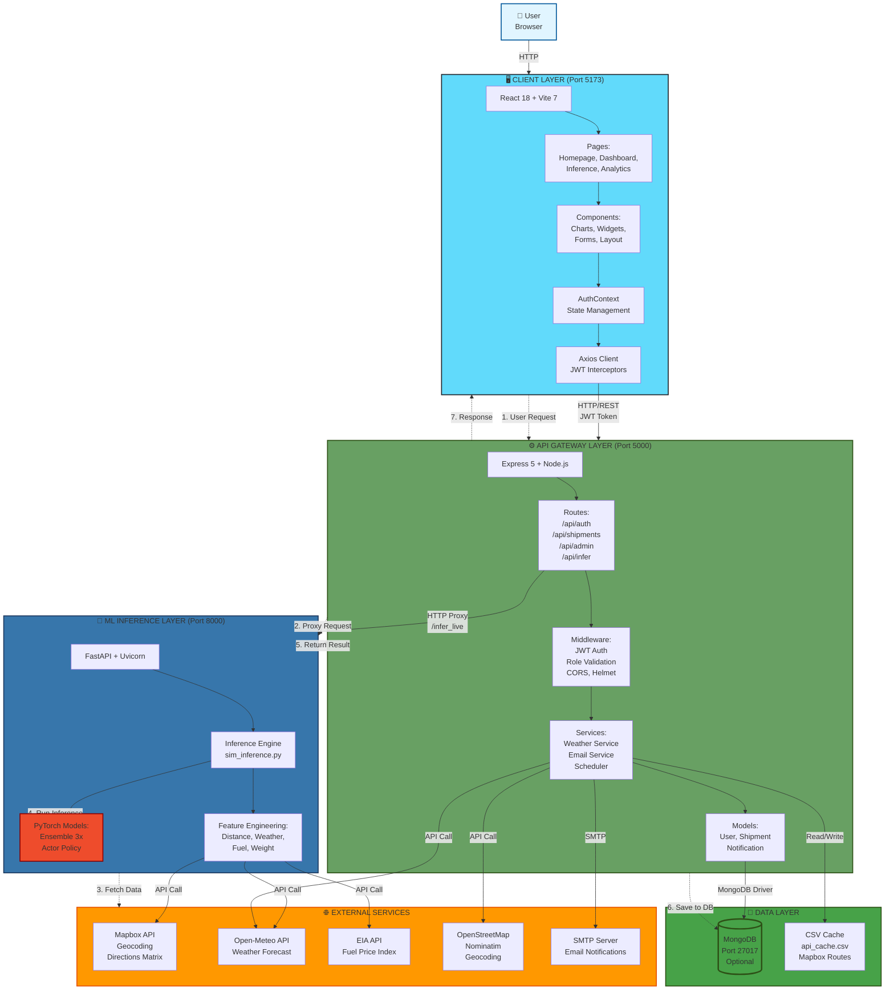

**This single diagram shows:**
- All three service layers (Client, Server, ML Service)
- Internal component structure of each layer
- Data layer (MongoDB + CSV cache)
- External API integrations
- Complete data flow (numbered steps 1-7)
- Technology stack within each layer

---

## 1. High-Level System Architecture

```mermaid
graph TB
    subgraph "Client Layer"
        A[React Client<br/>Port 5173<br/>Vite + React 18]
    end
    
    subgraph "API Gateway Layer"
        B[Express Server<br/>Port 5000<br/>Node.js + Express]
    end
    
    subgraph "ML Inference Layer"
        C[FastAPI Service<br/>Port 8000<br/>Python + PyTorch]
    end
    
    subgraph "Data Layer"
        D[(MongoDB<br/>Optional<br/>Port 27017)]
        E[CSV Cache<br/>api_cache.csv]
    end
    
    subgraph "External Services"
        F[Mapbox API<br/>Geocoding & Directions]
        G[Open-Meteo API<br/>Weather Data]
        H[EIA API<br/>Fuel Prices]
        I[OpenStreetMap<br/>Nominatim]
        J[SMTP Server<br/>Email Notifications]
    end
    
    A -->|HTTP/REST<br/>JWT Auth| B
    B -->|HTTP/REST<br/>Proxy| C
    B -->|MongoDB Driver| D
    C -->|Read/Write| E
    C -->|API Calls| F
    C -->|API Calls| G
    C -->|API Calls| H
    B -->|API Calls| I
    B -->|SMTP| J
    
    style A fill:#61dafb
    style B fill:#68a063
    style C fill:#3776ab
    style D fill:#47a248
    style E fill:#ffa500
    style F fill:#4264fb
    style G fill:#00a3e0
    style H fill:#003366
    style I fill:#7ecc49
    style J fill:#ea4335
```

---

## 2. Component Architecture & Data Flow

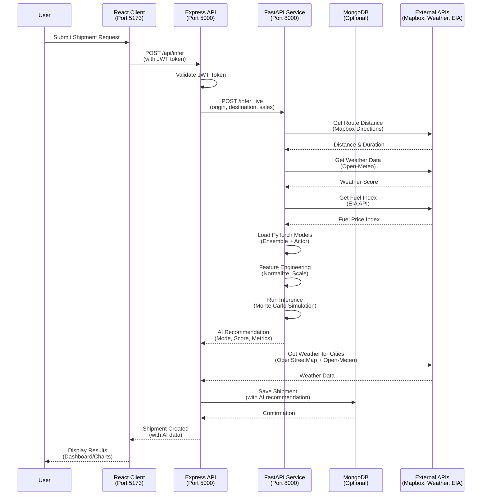

---

## 3. Service Layer Architecture

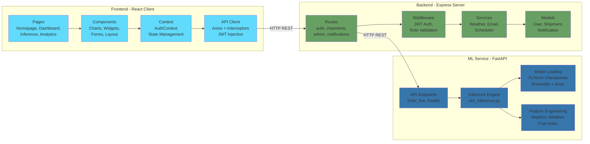

---

## 4. Technology Stack

```mermaid
graph TB
    subgraph "Frontend Stack"
        F1[React 18]
        F2[Vite 7]
        F3[React Router 6]
        F4[Tailwind CSS 3]
        F5[Axios 1.6]
        F6[Recharts 3]
        F7[Three.js 0.158]
        F8[Mapbox GL 3]
        F9[Framer Motion 11]
    end
    
    subgraph "Backend Stack"
        B1[Node.js 18+]
        B2[Express 5]
        B3[MongoDB 6]
        B4[JWT 9]
        B5[Bcrypt 2.4]
        B6[Helmet 7]
        B7[CORS 2.8]
        B8[Nodemailer 6]
    end
    
    subgraph "ML Service Stack"
        M1[Python 3.10+]
        M2[FastAPI 0.115]
        M3[Uvicorn 0.32]
        M4[PyTorch 2.5.0]
        M5[NumPy 1.26]
        M6[Pandas 2.2]
        M7[Requests 2.32]
    end
    
    subgraph "External APIs"
        E1[Mapbox]
        E2[Open-Meteo]
        E3[EIA.gov]
        E4[OpenStreetMap]
        E5[SMTP]
    end
    
    Root[Sim-to-Dec Platform] --> F1
    Root --> B1
    Root --> M1
    Root --> E1
    
    F1 --> F2
    F2 --> F3
    F3 --> F4
    F4 --> F5
    F5 --> F6
    F6 --> F7
    F7 --> F8
    F8 --> F9
    
    B1 --> B2
    B2 --> B3
    B2 --> B4
    B4 --> B5
    B5 --> B6
    B6 --> B7
    B7 --> B8
    
    M1 --> M2
    M2 --> M3
    M3 --> M4
    M4 --> M5
    M5 --> M6
    M6 --> M7
    
    style Root fill:#4a90e2,stroke:#333,stroke-width:3px
    style F1 fill:#61dafb
    style F2 fill:#61dafb
    style F3 fill:#61dafb
    style F4 fill:#61dafb
    style F5 fill:#61dafb
    style F6 fill:#61dafb
    style F7 fill:#61dafb
    style F8 fill:#61dafb
    style F9 fill:#61dafb
    style B1 fill:#68a063
    style B2 fill:#68a063
    style B3 fill:#68a063
    style B4 fill:#68a063
    style B5 fill:#68a063
    style B6 fill:#68a063
    style B7 fill:#68a063
    style B8 fill:#68a063
    style M1 fill:#3776ab
    style M2 fill:#3776ab
    style M3 fill:#3776ab
    style M4 fill:#3776ab
    style M5 fill:#3776ab
    style M6 fill:#3776ab
    style M7 fill:#3776ab
    style E1 fill:#4264fb
    style E2 fill:#00a3e0
    style E3 fill:#003366
    style E4 fill:#7ecc49
    style E5 fill:#ea4335
```

---

## 5. Database Schema (MongoDB Collections)

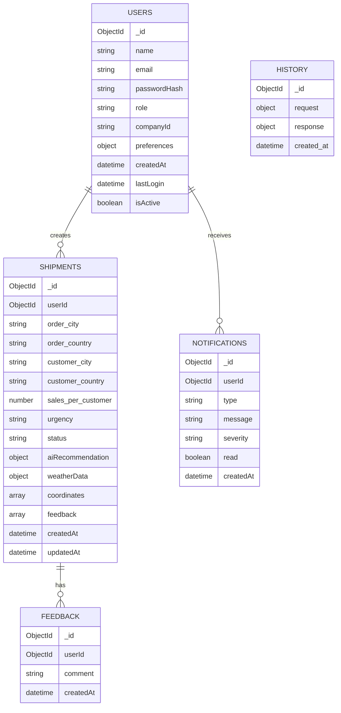

---

## 6. API Endpoints Architecture

```mermaid
graph TD
    subgraph "Client Requests"
        A[React Client<br/>localhost:5173]
    end
    
    subgraph "Express Server API<br/>localhost:5000"
        B1[POST /api/auth/register]
        B2[POST /api/auth/login]
        B3[GET /api/auth/me]
        B4[POST /api/infer]
        B5[POST /api/shipments/create]
        B6[GET /api/shipments/all]
        B7[GET /api/shipments/:id]
        B8[POST /api/shipments/:id/approve]
        B9[POST /api/shipments/:id/feedback]
        B10[GET /api/shipments/stats/overview]
        B11[GET /api/admin/users]
        B12[PUT /api/admin/users/:id/role]
        B13[GET /api/admin/stats]
        B14[GET /api/admin/model/status]
        B15[GET /api/notifications]
        B16[GET /api/reports/data]
    end
    
    subgraph "FastAPI Service<br/>localhost:8000"
        C1[POST /infer_live]
        C2[GET /health]
    end
    
    A -->|JWT Auth| B1
    A -->|JWT Auth| B2
    A -->|JWT Token| B3
    A -->|Public| B4
    A -->|JWT + Role| B5
    A -->|JWT + Role| B6
    A -->|JWT + Role| B7
    A -->|JWT + Manager| B8
    A -->|JWT + Role| B9
    A -->|JWT + Analyst| B10
    A -->|JWT + Admin| B11
    A -->|JWT + Admin| B12
    A -->|JWT + Admin| B13
    A -->|JWT + Admin| B14
    A -->|JWT + Role| B15
    A -->|JWT + Role| B16
    
    B4 -->|Proxy| C1
    B5 -->|Proxy| C1
    B14 -->|Health Check| C2
    
    style A fill:#61dafb
    style B1 fill:#68a063
    style B2 fill:#68a063
    style B3 fill:#68a063
    style B4 fill:#68a063
    style B5 fill:#68a063
    style B6 fill:#68a063
    style B7 fill:#68a063
    style B8 fill:#68a063
    style B9 fill:#68a063
    style B10 fill:#68a063
    style B11 fill:#68a063
    style B12 fill:#68a063
    style B13 fill:#68a063
    style B14 fill:#68a063
    style B15 fill:#68a063
    style B16 fill:#68a063
    style C1 fill:#3776ab
    style C2 fill:#3776ab
```

---

## 7. ML Inference Pipeline

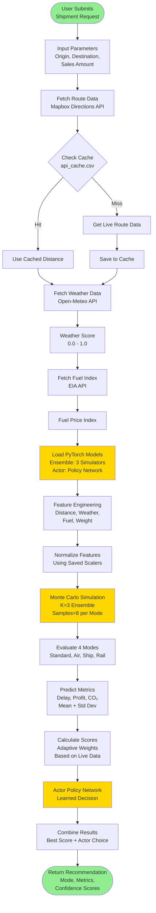

---

## 8. Authentication & Authorization Flow

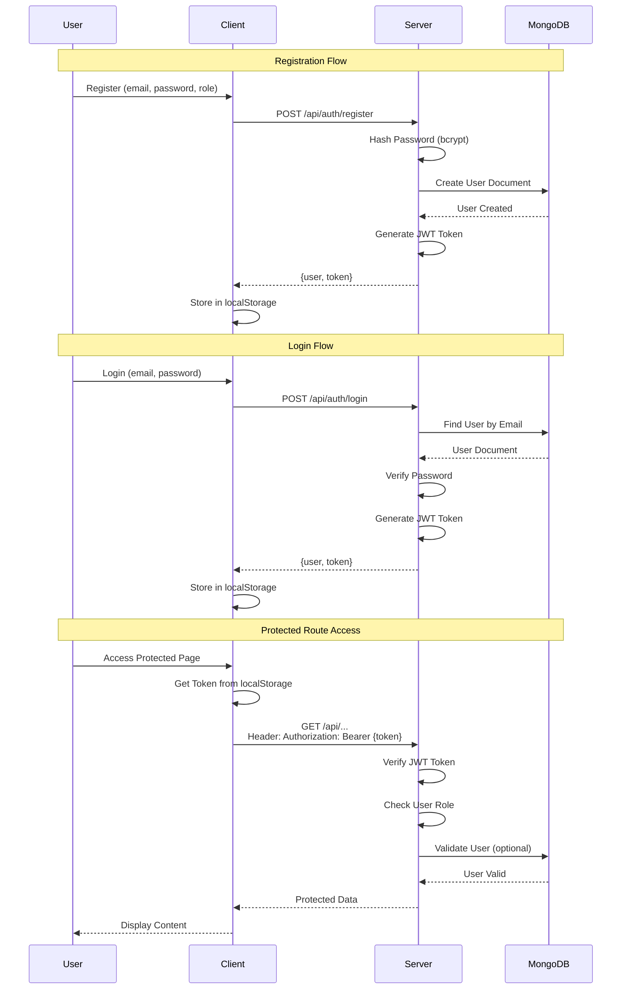

---

## 9. Deployment Architecture

```mermaid
graph TB
    subgraph "Production Environment"
        subgraph "Client Hosting"
            A1[Static Files<br/>React Build<br/>Vite Dist]
            A2[CDN/Static Host<br/>Render, Vercel,<br/>or S3 + CloudFront]
        end
        
        subgraph "Backend Hosting"
            B1[Node.js Runtime<br/>Express Server]
            B2[Hosting Platform<br/>Render, Heroku,<br/>or AWS EC2]
            B3[Environment Variables<br/>.env file]
        end
        
        subgraph "ML Service Hosting"
            C1[Python Runtime<br/>FastAPI + Uvicorn]
            C2[Hosting Platform<br/>Render, Railway,<br/>or AWS EC2/ECS]
            C3[GPU Support<br/>Optional for<br/>Faster Inference]
        end
        
        subgraph "Database"
            D1[MongoDB Atlas<br/>Cloud Database<br/>or Self-Hosted]
        end
        
        subgraph "External Services"
            E1[Mapbox API<br/>API Key Required]
            E2[Open-Meteo<br/>No Key Required]
            E3[EIA API<br/>Optional Key]
            E4[SMTP Service<br/>SendGrid, AWS SES,<br/>or Custom]
        end
    end
    
    A1 --> A2
    B1 --> B2
    B1 --> B3
    C1 --> C2
    C1 --> C3
    
    A2 -->|HTTPS| B2
    B2 -->|HTTPS| C2
    B2 -->|Connection String| D1
    C2 -->|API Calls| E1
    C2 -->|API Calls| E2
    C2 -->|API Calls| E3
    B2 -->|SMTP| E4
    
    style A1 fill:#61dafb
    style A2 fill:#61dafb
    style B1 fill:#68a063
    style B2 fill:#68a063
    style C1 fill:#3776ab
    style C2 fill:#3776ab
    style D1 fill:#47a248
    style E1 fill:#4264fb
    style E2 fill:#00a3e0
    style E3 fill:#003366
    style E4 fill:#ea4335
```

---

## 10. Network Ports & Communication

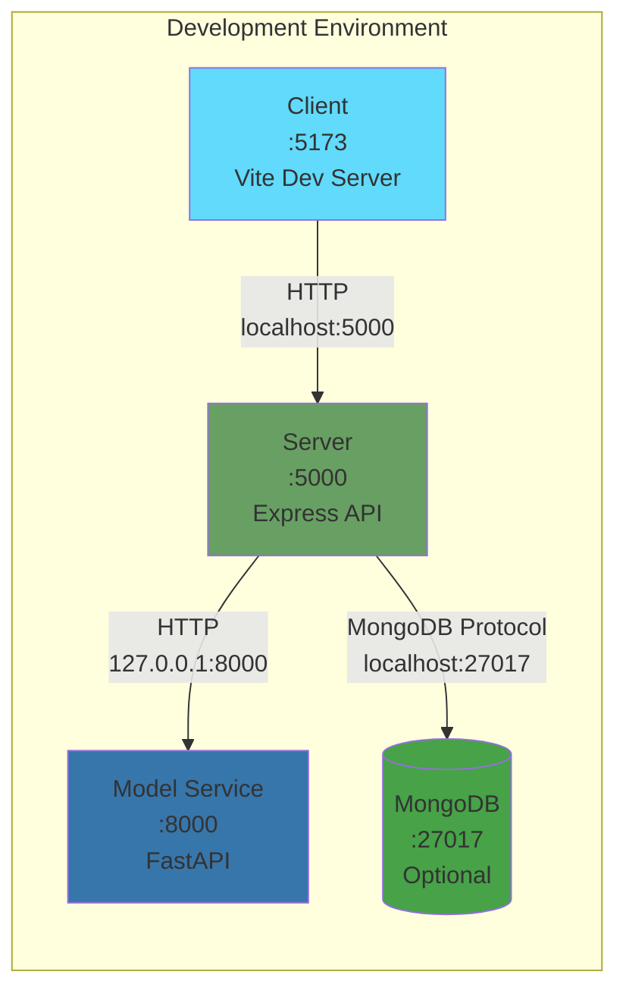

---

## 11. File Structure Overview

```
sim-to-dec-platform/
│
├── client/                          # React Frontend
│   ├── src/
│   │   ├── api/
│   │   │   └── backendAPI.js        # Axios client with interceptors
│   │   ├── components/
│   │   │   ├── Auth/                # Login, Register forms
│   │   │   ├── Charts/              # Recharts, D3 visualizations
│   │   │   ├── Dashboard/           # Role-based dashboards
│   │   │   ├── Layout/              # Navbar, Sidebar
│   │   │   ├── Shipment/            # Shipment CRUD components
│   │   │   ├── Widgets/             # Weather, Fuel widgets
│   │   │   └── Chatbot/             # AI Chatbot
│   │   ├── context/
│   │   │   └── AuthContext.jsx      # Global auth state
│   │   ├── pages/                   # Route pages
│   │   └── utils/                   # Helper functions
│   ├── package.json
│   └── vite.config.js
│
├── server/                           # Express Backend
│   ├── routes/
│   │   ├── auth.js                  # Authentication routes
│   │   ├── shipments.js             # Shipment management
│   │   ├── admin.js                 # Admin operations
│   │   ├── notifications.js         # Notification system
│   │   └── reports.js               # Analytics reports
│   ├── models/
│   │   ├── User.js                  # User model
│   │   ├── Shipment.js              # Shipment model
│   │   └── Notification.js          # Notification model
│   ├── middleware/
│   │   └── auth.js                  # JWT validation
│   ├── services/
│   │   ├── weatherService.js        # Weather API integration
│   │   ├── emailService.js          # SMTP email service
│   │   └── scheduler.js             # Background jobs
│   ├── index.js                     # Express app entry
│   └── package.json
│
├── model_service/                    # FastAPI ML Service
│   ├── main.py                      # FastAPI app
│   ├── sim_inference.py             # Inference engine
│   ├── models/
│   │   ├── sim_v40_seed*.pth        # Simulator ensemble (3 files)
│   │   ├── actor_best_v40.pth       # Actor policy network
│   │   └── api_cache.csv            # Mapbox cache
│   ├── requirements.txt
│   └── run.sh / run.bat
│
└── package.json                     # Root scripts
```

---

## 12. Key Design Patterns

### 12.1 Service Communication Pattern
- **Client → Server**: RESTful HTTP with JWT authentication
- **Server → Model Service**: HTTP proxy pattern (server acts as gateway)
- **All Services**: Independent deployment, communicate via HTTP

### 12.2 Authentication Pattern
- **JWT-based**: Stateless authentication
- **Role-based Access Control (RBAC)**: Operator, Manager, Analyst, Admin
- **Token Storage**: localStorage in client (SPA pattern)

### 12.3 Data Flow Pattern
- **Request Flow**: Client → Server → Model Service → External APIs
- **Response Flow**: External APIs → Model Service → Server → Client
- **Caching**: Mapbox responses cached in CSV file

### 12.4 Error Handling Pattern
- **Graceful Degradation**: Services work without MongoDB
- **Fallback Values**: Model service uses simulated data if APIs fail
- **Error Middleware**: Centralized error handling in Express

---

## 13. Security Architecture

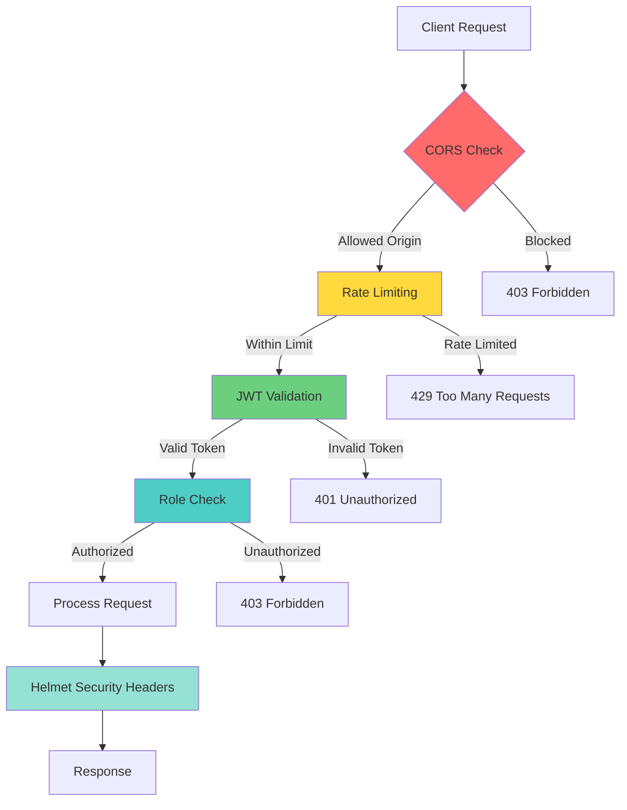

---

## Summary

This architecture supports:
- ✅ **Microservices**: Three independent services (Client, Server, ML Service)
- ✅ **Scalability**: Each service can scale independently
- ✅ **Resilience**: Graceful degradation without MongoDB
- ✅ **Security**: JWT auth, CORS, rate limiting, helmet
- ✅ **Flexibility**: Optional MongoDB, fallback APIs
- ✅ **Modern Stack**: React 18, Express 5, FastAPI, PyTorch

---

**Note**: These diagrams use Mermaid syntax and can be rendered in:
- GitHub/GitLab markdown viewers
- VS Code with Mermaid extension
- Online tools like mermaid.live
- Documentation platforms (GitBook, Notion, etc.)

